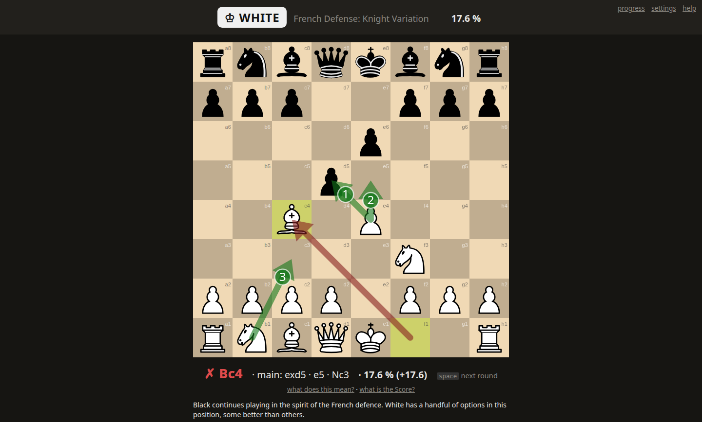

# chessop

Grind chess openings against the moves people at your rating really play, drawn from Lichess
games. Free, no sign-up.

**<https://chessop.fr>**



## Run it yourself

Drill chess openings by playing rounds against an opponent sampled from the Lichess games of your
rating band. chessop keeps a half-life memory per position, steers each round toward what you know
least, and shows one Score for how well you know your repertoire. It is local, single-learner and
offline: the opening data ships inside the package.

### Install

```sh
uv tool install .          # from a checkout of this repository
uv tool install git+<url>  # or straight from the repository
```

Python 3.12 or later. No network access is needed once installed.

### Use

- `chessop`: serve on `127.0.0.1:8000` (or a free port) and open the play page in the browser.
- `chessop serve --host 0.0.0.0 --port 8000`: serve for a device on the LAN, no authentication.
- `--data-dir <path>` (or `CHESSOP_DATA_DIR`): where your progress is kept; default
  `~/.local/share/chessop/`.
- `--snapshot <path>`: drill from another graph file than the packaged one; its explanation file
  is read from beside it.

### Building a snapshot

The packaged snapshot is built by the developer at release time from a capped prefix of one month
of the Lichess dump (150,000 games per rating band). To build one yourself from a checkout:

```sh
uv run --extra build chessop build-snapshot --month YYYY-MM --out my.graph.json.gz
```

This streams the month's dump from `database.lichess.org`, reads the book from
`refs/lichess/`, queries English Wikibooks for the explanations, and writes `my.graph.json.gz`
and `my.explanations.json.gz`. Then `chessop --snapshot my.graph.json.gz`.

## Hosting your own

`chessop serve --hosted` serves the public site, configured by the `CHESSOP_*` environment; the
scripts and service files `chessop.fr` runs on are in `deploy/`, and its runbook is
[`docs/operating.md`](docs/operating.md). They are published as they are: no support is offered
for hosting your own.

## Licences

chessop is free software, licensed under the **GNU General Public License, version 3 or later**
(GPL-3.0-or-later), as python-chess and chessground require. The texts of every licence below are
in [`LICENSES/`](LICENSES/).

- **chessop** (the app): GPL-3.0-or-later, [`LICENSES/GPL-3.0-or-later.txt`](LICENSES/GPL-3.0-or-later.txt).
- **python-chess** by Niklas Fiekas and contributors, a runtime dependency: GPL-3.0-or-later.
- **chessground** by Lichess (Thibault Duplessis and contributors,
  <https://github.com/lichess-org/chessground>): GPL-3.0-or-later. Its script and stylesheets are
  vendored under `src/chessop/static/chessground/` with their licence.
- **cburnett piece set** by Colin M.L. Burnett (embedded in `chessground.cburnett.css`):
  CC BY-SA 3.0, <https://creativecommons.org/licenses/by-sa/3.0/>,
  [`LICENSES/CC-BY-SA-3.0.txt`](LICENSES/CC-BY-SA-3.0.txt).
- **Sounds**: the Lichess "sfx" set by Enigmahack (<https://github.com/Enigmahack>), from
  lichess-org/lila: AGPL-3.0-or-later, [`LICENSES/AGPL-3.0.txt`](LICENSES/AGPL-3.0.txt). Vendored
  under `src/chessop/static/sound/` with its licence and a NOTICE.
- **Opening explanations**: text from the Wikibooks book *Chess Opening Theory*
  (<https://en.wikibooks.org/wiki/Chess_Opening_Theory>), by its Wikibooks contributors, CC BY-SA
  4.0, <https://creativecommons.org/licenses/by-sa/4.0/>,
  [`LICENSES/CC-BY-SA-4.0.txt`](LICENSES/CC-BY-SA-4.0.txt). The text was trimmed (headings,
  tables, reply lists, links and references removed) and is kept in its own data file,
  `src/chessop/data/snapshot.explanations.json.gz`, which carries the licence notice; each
  explanation shown links its page.
- **Games**: the Lichess open database (<https://database.lichess.org/>), CC0 1.0,
  [`LICENSES/CC0-1.0.txt`](LICENSES/CC0-1.0.txt). The graph file
  `src/chessop/data/snapshot.graph.json.gz` is derived from it and is CC0 data.
- **Opening names**: the Lichess `chess-openings` book (<https://github.com/lichess-org/chess-openings>),
  CC0 1.0, used at build time; the names in the graph file come from it.
